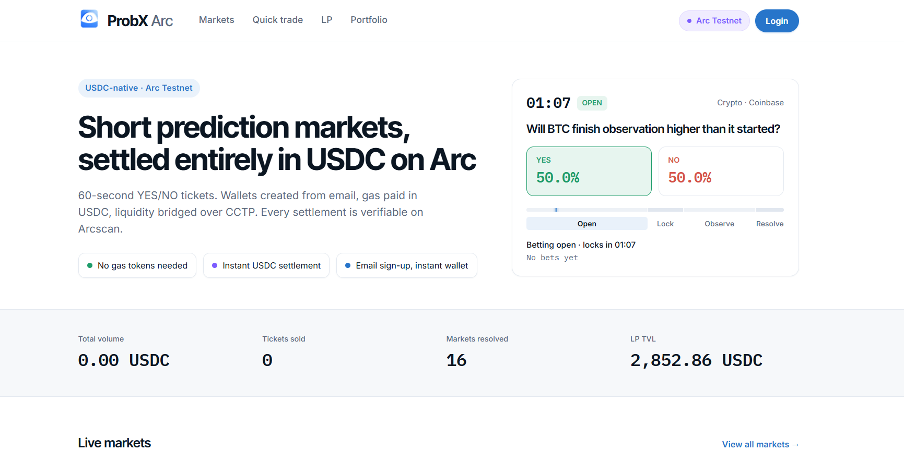

<h1 align="center">ProbX Arc</h1>

<p align="center">
  <strong>Programmable USDC settlement on Arc</strong><br/>
  Conditional escrow · parametric payouts · LP-underwritten reserves · Circle stack
</p>

<p align="center">
  <strong><a href="https://probx-web.vercel.app">▶ Live demo</a></strong> ·
  <a href="#see-it-in-2-minutes">See it in 2 minutes</a> ·
  <a href="#book-economics">Book economics</a> ·
  <a href="#security">Security</a> ·
  <a href="#scope">Scope</a>
</p>

<p align="center">
  
</p>

<p align="center">
  <a href="https://testnet.arcscan.app"></a>
  <a href="#arc-testnet"></a>
  <a href="#circle-cctp--app-kits"></a>
  
  
</p>

---

## What this is

ProbX is **programmable USDC settlement infrastructure** on Arc: capital is reserved up
front against a binary condition, an oracle posts the outcome, and USDC settles
automatically — no ETH, no multi-asset gas path.

Built for **parametric insurance, SLA compensation, and conditional escrow**. Short-horizon
BTC / London-temp markets in the live demo are a **fast technical loop** (fund → position →
resolve → claim in ~2 minutes), not the product thesis.

Three primitives:

| Primitive | What it does |
|-----------|--------------|
| **Liquidity vault** | LPs deposit USDC and underwrite payouts; earn book margin + fees |
| **Reserve engine** | Reserves the max payout *before* accepting a position — no undercollateralised exposure |
| **Micro Boost** | Optional payout multiplier, gated by live LP capacity |

**Why Arc:** a tight settlement cycle is not viable when a user needs a second asset for
gas and confirmation takes twelve seconds. On Arc, gas is USDC and finality is sub-second,
so the entire flow — fund, position, resolve, claim — stays in one asset.

---

## See it in 2 minutes

1. Open the [live demo](https://probx-web.vercel.app) → **Markets**. Continuous demo loops (BTC direction / London temp) exercise the full reserve → resolve → claim path on a ~75s entry / 60s observation cycle.
2. Sign in with email (Circle Developer-Controlled wallet on Arc) or MetaMask.
3. Fund with testnet USDC — directly on Arc, or from Base Sepolia via **App Kit bridge** (mint lands on the **session** Arc address shown in the UI).
4. Take a YES/NO position, optionally with Micro Boost. Watch the live chart against the start line, then claim after auto-resolve.

Gas is paid in USDC. There is no ETH step anywhere in that flow.

> Markets are driven by an **external** minute pinger (see [docs/DEPLOYMENT.md](docs/DEPLOYMENT.md#markets-247-cron)). If the list looks empty, the pinger is down, not the app — any page load also kicks the cycle in the background.

---

## Micro Boost

Short-horizon exposure can't use classic margin: liquidations and mark prices don't fit a
60-second window. Micro Boost solves it differently — the vault reserves the maximum
payout before the position is accepted, so user downside is bounded by the stake and LP
downside is bounded by the reserve.

```text
payout ≈ (stake / odds) × boost
reserve  = payout − stake
accept only if LP available ≥ reserve
```

Everything settles in USDC. On Arc, gas is USDC too.

---

## Book economics

Short-horizon books die if the price is a pure 50/50 mid with free leverage. Three guards
keep informed flow from draining the vault:

### 1. Price margin (overround) — enforced on-chain
Quoted YES+NO sums to **≈108%** of fair scale (`OVERROUND_BPS = 10800`). That margin is
the first layer of house edge and funds modest boost.

- **UI:** odds display as normalised shares summing to 100%, so users never see a "108% market".
- **Pricing:** raw on-chain prices (with overround) drive payout math.
- **API:** `applyPriceMargin()` in `quoteEngine.ts` mirrors contract quoting.

That margin only protects the vault while flow cannot push price *past* it, so the book
enforces the bound directly. Fair mid may drift from its seed by at most
`MAX_MID_DRIFT_BPS = 700` of the cheaper side — under the `741` bps at which a 108%
overround stops covering the move (`1 − 10000/OVERROUND_BPS`). Virtual depth is sized from
LP capital at market creation (`managedAssets / IMPACT_DEPTH_DIVISOR`, floored at 5 000
USDC) rather than a fixed constant, so odds move against the capital underwriting them.

**Invariant:** no reachable book state quotes a side below its seed fair value, under any
sequence of legal trades. Fuzzed in `BookManipulation.t.sol`.

### 2. Boost pricing is calibrated, not assumed

Boost multiplies payout, so its cost to the vault depends on one variable the protocol
cannot know in advance: **how well the flow prices the book.** A book facing sharp flow
pays for every unit of boost; a book facing uninformed flow recovers most of it from the
overround. The boost curve is therefore an empirical parameter, not a constant.

| Band | Funding |
|------|---------|
| **≤ ~1.09×** (`1 + margin`) | Covered by book overround in expectation, independent of flow quality |
| **Above the self-funded band** | `BOOST_FEE_BPS = 400` recovers part of the cost; the remainder is a **deliberate subsidy** |

That subsidy is the point, not an oversight. The self-funded ceiling scales with realized
flow quality — the weaker the flow prices the book, the higher boost can go before it costs
the vault anything. Pricing that curve requires observed settlement data across a meaningful
sample of tickets, which a testnet deployment does not produce. Until then the vault runs
boost as a **priced experiment**: `MAX_BOOST_BPS = 50_000` opens the full range so the demo
generates flow data across it, and the subsidy is the cost of acquiring that data.
`maxBoost()` respects live LP capacity at every level, so the experiment is bounded by
available reserves rather than by an assumed edge.

> **Current numbers are initial parameters, not a converged economic model.**
> Production sizing would set the boost curve from measured flow quality per
> market type, per horizon, and per cohort — the same way a book prices enhanced
> odds against observed customer yield rather than against a fixed formula.

### 3. Timing: hard entry cutoff + lock pause

```text
open ──► lock ──► pause (10s) ──► observation ──► resolve
```

- **Hard cutoff (on-chain):** `MicroMarket.canBuy()` requires `block.timestamp < lockTime`, so entry stops at `lockTime` whether or not `lock()` has been called.
- **Lock pause:** `observationStart = lockTime + pause`, default **10s** (`MARKET_LOCK_PAUSE_SECONDS`). No position can land within 10s of the observation window opening, so nobody enters against a print they already know.
- **Sniper buffer:** `MARKET_SNIPER_BUFFER_SECONDS` (default 5s) trims the entry window; `MARKET_CREATE_TX_SLACK_SECONDS` (default 18s) pads it to absorb create+open latency. Net for a nominal 75s window: `lockTime ≈ open + 88s`, visible entry window ~60–75s.

### 4. Seed odds from the feed
New markets estimate a fair mid from live structure before applying overround — BTC from
recent return (random-walk prior), London temp with a modest YES tilt (temperature is
sticky over 60s). No free lunch on mispriced flat 50/50 tickets.

> **Deploy note:** overround and boost fee live in **contract bytecode**. Redeploy after changing those constants.

---

## Security

The reserve engine holds user funds, so the invariants are covered by tests rather than
assumed. `pnpm contracts:test` → **50 passing**: 25 scenario + 3 registry + 6 LP vault
+ 12 accounting invariant checks and fuzz tests, + 4 book-manipulation regressions
(includes price-mid, settle CEI, fee-router access, and dust-manipulation regressions).

| Area | Guarantee | Test |
|------|-----------|------|
| **Book integrity** | No reachable book state quotes a side below its seed fair value, under any sequence of legal trades — so flow can never push price past the overround that funds the book. Virtual depth scales with LP capital rather than a fixed constant | [`BookManipulation.t.sol`](./contracts/test/BookManipulation.t.sol) |
| **Quote integrity** | Price impact is strictly proportional to stake; `MIN_USER_RISK_PER_TICKET` (0.25 USDC) rejects sub-minimum stakes outright | [`DustManipulation.t.sol`](./contracts/test/DustManipulation.t.sol) |
| **Resolution timing** | `resolve()` reverts until the full observation window has elapsed (`observationEnd`), independent of resolver-key discipline | [`ObservationResolve.t.sol`](./contracts/test/ObservationResolve.t.sol) |
| **Share pricing** | Vault prices shares off an internal ledger (`internalAssets`), not token balance — direct transfers cannot inflate share value | [`DonationAttack.t.sol`](./contracts/test/DonationAttack.t.sol) |
| **Reserve accounting** | Every payout, loss and refund reconciles reserved + locked balances | [`ReserveAccounting.t.sol`](./contracts/test/ReserveAccounting.t.sol) |
| **Settlement** | Win / loss / cancel / batch paths, plus fee routing | [`Settlement.t.sol`](./contracts/test/Settlement.t.sol) |
| **Exposure caps** | Per-market, per-outcome and per-user reserve caps; market-level solvency check before accepting | [`Fixes.t.sol`](./contracts/test/Fixes.t.sol) |

Batch settlement isolates failures: `settleBatch()` settles each ticket through an external
self-call so one bad ticket cannot revert the batch.

---

## Features

- **On-chain engine** — factory, reserve engine, LP vault, position tickets on Arc Testnet
- **Micro Boost** — payout multiplier gated by live LP capacity
- **LP vault** — deposit / withdraw underwriting liquidity, on Arc or **from any chain**
- **Live feeds** — BTC (Coinbase) & London temp (Open-Meteo), auto-resolve
- **Circle Wallets** — email → Developer-Controlled EOA on Arc (fallback: local session EOA)
- **App Kits** — Send, Bridge and Unified Balance via `@circle-fin/app-kit`
- **CCTP** — USDC from Base Sepolia / Eth Sepolia → Arc
- **Durable wallet mapping** — email → walletId in Redis KV; recovery via Circle `listWallets(refId)`, no duplicate wallets after logout
- **Email OTP** — app-issued 6-digit code via SMTP (dev-echo locally)
- **Tx tracking** — position / claim / deposit / send tracked `pending → confirmed / failed`, reconciled server-side
- **Dual path** — email session or MetaMask throughout

---

## Architecture

```text
┌─────────────┐     ┌──────────────────────┐     ┌─────────────────────────┐
│  Next.js UI │────▶│  Next API routes     │────▶│  Arc Testnet            │
│  (Vercel)   │     │  apps/web/src/app/api│     │  Engine · Vault · Mkts  │
└──────┬──────┘     │  (+ optional apps/api│     └───────────┬─────────────┘
       │            │   standalone :3001)  │                 │
       │            └──────┬───────────────┘                 │ USDC
       │                   │                                 │
       │            ┌──────▼───────┐                 ┌───────▼───────┐
       └───────────▶│ Circle API   │                 │ App Kit       │
         email EOA  │ Wallets      │                 │ Send · Bridge │
                    └──────────────┘                 │ Unified Bal.  │
                                                     └───────────────┘
```

| Package | Role |
|---------|------|
| `apps/web` | Markets, portfolio, LP, admin, fund UI + **API route handlers** |
| `apps/api` | Shared services (quotes, Circle, App Kit, CCTP, workers); optional standalone server on `:3001` |
| `contracts` | Foundry sources + [tests](./contracts/test/) |
| `scripts/` | `deploy-arc`, smoke, demo markets, RPC preflight |

Local run, Vercel env, SMTP, and cron: **[`docs/DEPLOYMENT.md`](docs/DEPLOYMENT.md)**.

---

## Arc Testnet

| | |
|--|--|
| Chain ID | `5042002` |
| RPC | `https://rpc.testnet.arc.network` |
| Explorer | [testnet.arcscan.app](https://testnet.arcscan.app) |
| USDC | `0x3600000000000000000000000000000000000000` |
| Deployer | `0x4604a582B66431481D5320fed67C785bdb4D7Fe0` |

### Core contracts

| Contract | Address |
|----------|---------|
| MicroBoostEngine | [`0x469592aEff57eE56e910A75eA69a6538E8B59A67`](https://testnet.arcscan.app/address/0x469592aEff57eE56e910A75eA69a6538E8B59A67) |
| LiquidityPool | [`0xdB25f054D2D88c38FB06f74ADaD1b06e87a06De8`](https://testnet.arcscan.app/address/0xdB25f054D2D88c38FB06f74ADaD1b06e87a06De8) |
| MarketFactory | [`0xf659eDf16E55307095a08fd29727316513acdF19`](https://testnet.arcscan.app/address/0xf659eDf16E55307095a08fd29727316513acdF19) |
| PositionTicket | [`0x48500Ce7Bc323814f9092c31bFE6957DCEeA152C`](https://testnet.arcscan.app/address/0x48500Ce7Bc323814f9092c31bFE6957DCEeA152C) |
| OracleAdapter | [`0x6ACfEA3A4713bC723abcFE17Ee6E31FdFB9d3F16`](https://testnet.arcscan.app/address/0x6ACfEA3A4713bC723abcFE17Ee6E31FdFB9d3F16) |
| InsuranceFund | [`0xd35766360FAC570d67cB88D0C5b94EFD0aEeb781`](https://testnet.arcscan.app/address/0xd35766360FAC570d67cB88D0C5b94EFD0aEeb781) |
| FeeRouter | [`0xc6ABDD0D4dB15f347E0690F471098694E284AC63`](https://testnet.arcscan.app/address/0xc6ABDD0D4dB15f347E0690F471098694E284AC63) |

Deployed **2026-07-27 14:46 UTC** (free-capital LP + registry + manipulation-resistant book). LP seed: **100000 USDC**. `fromBlock`: **53938140**.  
Vercel paste: [`docs/VERCEL_ENV_UPDATE.md`](docs/VERCEL_ENV_UPDATE.md). Full JSON: [`docs/DEPLOYMENT_ARC_TESTNET.json`](docs/DEPLOYMENT_ARC_TESTNET.json).

---

## Circle, CCTP & App Kits

| Capability | Implementation |
|------------|----------------|
| Email login | Circle **Developer-Controlled** wallets on `ARC-TESTNET` |
| Fallback | Local encrypted session EOA if `CIRCLE_*` incomplete |
| OTP | App-issued 6-digit code (SMTP in prod; `EMAIL_OTP_DEV_ECHO=1` shows code in UI locally) |
| **Send** | App Kit `kit.send` on Arc; Circle DCW transfer via `tokenId`; raw viem fallback |
| **Bridge** | App Kit `kit.bridge` (CCTP v2 underneath); manual CCTP Forwarding fallback |
| **LP liquidity** | On-Arc vault deposit, plus **Any chain** tab — Unified Balance where available, else App Kit bridge → deposit |
| Gas | User pays **USDC** on Arc |

Packages: `@circle-fin/app-kit`, `@circle-fin/adapter-viem-v2`.

Successful App Kit flows surface as `⚡ via Circle App Kit`. Failures name the fallback
(`viem-fallback` / manual CCTP) — never silent. Optional `APP_KIT_STRICT=1` hard-fails
instead of falling back.

MetaMask can burn on the source chain while the mint lands on the email session — separate
connect, no session hijack.

Server Circle / SMTP / session env vars: [`docs/DEPLOYMENT.md`](docs/DEPLOYMENT.md).

---

## User flow

```text
Connect (email or MetaMask)
    → Fund USDC (direct on Arc, App Kit bridge, or receive a Send)
    → Optional: LP deposit (on Arc, or from any chain)
    → Take YES/NO position (+ boost if vault allows)   [tx: pending → confirmed]
    → Wait lock + observation (live chart vs start line)
    → Auto/manual resolve → settle / claim
    → Send USDC out to any Arc address anytime
```

**Admin:** `/admin` — create test markets (demo oracles). No UI entry point; open the URL
directly. On Vercel/production, admin is **closed** unless `ADMIN_SECRET` (or `CRON_SECRET`)
is set; locally it stays open with a warning.

---

## Scope

Testnet deployment built for a hackathon. Honest limits:

- **Settlement engine first; markets are the demo.** The on-chain product is reserve accounting + LP underwriting + USDC settlement. Minute BTC tickets show the cycle works; they are not a production betting product.
- **Custodial by design (email path).** Circle Developer-Controlled wallets (or a local session EOA fallback) mean the server can sign for email users. MetaMask users hold their own keys.
- **Oracle is centralized today.** Owner/oracle can resolve; feeds are server-side (Coinbase / Open-Meteo). No quorum, on-chain attestation, or dispute period yet — acceptable for demo, not production infrastructure claims.
- **Demo risk parameters.** **100000 USDC** seeded vault with loose exposure caps (`MAX_LP_RESERVE_PER_USER_BPS = 8000`). Sized so a demo can exercise full boost range.
- **Ops dependencies.** External minute pinger for 24/7 cycles; `ADMIN_SECRET` / `OTP_HMAC_SECRET` required on shared deploys (fail closed on Vercel when unset).
- **Contract security.** Engine only accepts markets from the factory registry (`isMarket`). **Live stack must be redeployed** after this change — frontend alone cannot patch the old engine.

---

## Docs

| Doc | Contents |
|-----|----------|
| **[`docs/DEPLOYMENT.md`](docs/DEPLOYMENT.md)** | Local run, Vercel settings, env vars, SMTP, cron |
| [`docs/VERCEL_ENV_UPDATE.md`](docs/VERCEL_ENV_UPDATE.md) | Address bump after redeploy |
| [`docs/DEPLOYMENT_ARC_TESTNET.json`](docs/DEPLOYMENT_ARC_TESTNET.json) | Live contract addresses |
| [`docs/EXTERNAL_CRON.md`](docs/EXTERNAL_CRON.md) | Minute pinger setup |
| [`contracts/test/`](./contracts/test/) | **46** forge tests: 25 scenario + 3 registry + 6 LP + 12 accounting/fuzz — `pnpm contracts:test` |
| [`.env.example`](.env.example) | Full env template |
| [`LICENSE`](./LICENSE) | MIT |

---

<p align="center">
  <sub>Built for Arc · Programmable money · USDC all the way down</sub>
</p>
